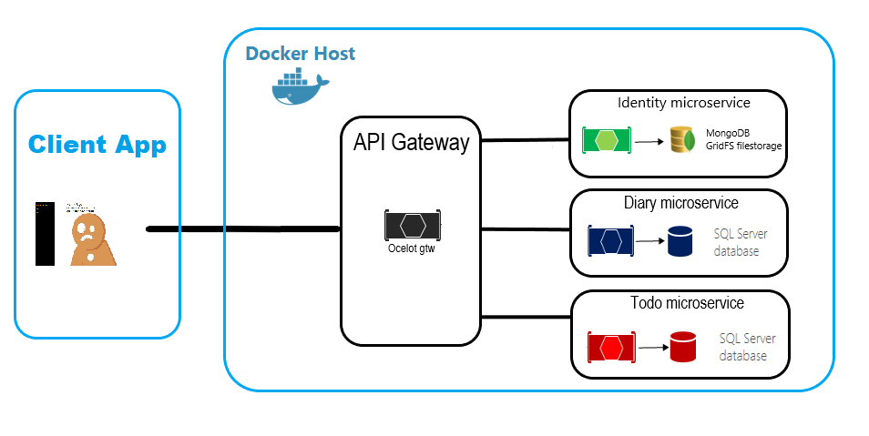

# App On Containers
As a tradition i choosed random name for this project.

## Why i decided to create this app?
One friday evening, it was a rainy day, I was watching YouTube and found a video on Microsoft Visual Studio channel called "Microservice Architecture using .Net Core and Docker". I opened it and was impressed by how cool it is. And here was the entry point.

## About
**Let`s start from little description of this project.**
**Architecture schema:** 
**Client side. One Gateway. Simple microservices.**
**And it's Crossplatform. Run wherever you want: Windows, Linux, macOs. .Net Core + Docker makes Magic**

## Tools for building this app:
**For Client side:**
 * Angular/Typescript

 **For Server side:**
  * .Net Core
  * Docker

I wanted to create a SPA, cuz i love them, it's awesome and also i didn't want to write AJAX code using JS. As for me TypeScript is the best tool for C# or Java developer. TS is clean, understandable and strong typed. I like it.

Server side made using .Net Core, because i`m using C# as my main programming language. And also Docker to implement Microservice Architecture.

## Experience
I've got a lot of experience. I've learnt new framework: Angular, it's pretty easy to star working with it.

Docker: i can say only one thing about docker. "Oh my God!". It means that how cool it is, when you are running part of the whole app on a mini virtual box and probably do nothing. Type 'docker-compose up' and it works. But first of all you need to create this file, create images and other things. And so now i can say that i know some basics of how to create Dockerfile, create docker-compose.yml file, tune it, and run my app using PowerShell(I'm waiting for Windows Terminal btw). Cool experience at all.

## For the Future
Now App On Containers is like ALpha version of what i want to see.
Probably I'll try to add something everyday, but if it's no commits that means that I'm learning how to create something or thinking about new functions of this app.

### P.s
Sorry for my CSS knowledge, just Bootstrap and everything is done)